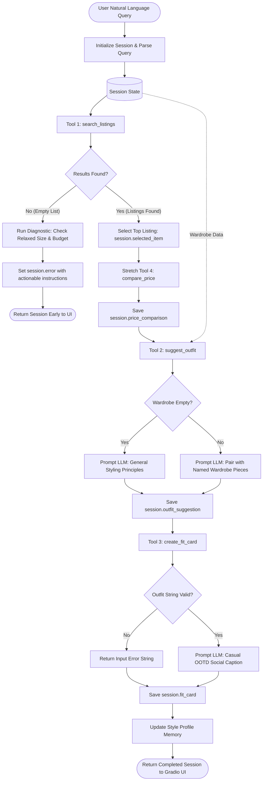

# FitFindr — planning.md

> Complete this document before writing any implementation code.
> Your spec and agent diagram are what you'll use to direct AI tools (Claude, Copilot, etc.) to generate your implementation — the more specific they are, the more useful the generated code will be.
> Your planning.md will be reviewed as part of your submission.
> Update it before starting any stretch features.

---

## Tools

List every tool your agent will use. For each tool, fill in all four fields.
You must have at least 3 tools. The three required tools are listed — add any additional tools below them.

### Tool 1: search_listings

**What it does:**
Searches the mock secondhand listings dataset (`data/listings.json`) by filtering available items against an optional size and price ceiling, then scoring and ranking the remaining items by keyword relevance overlap against the user's search description.

**Input parameters:**
- `description` (str): Free-text search terms describing the desired clothing item, aesthetic, or category (e.g., `"vintage graphic tee"`, `"black combat boots"`).
- `size` (str | None): Optional clothing size string to filter by (e.g., `"M"`, `"L"`, `"S/M"`). Matching is case-insensitive. Set to `None` to disable size filtering.
- `max_price` (float | None): Optional maximum price ceiling in USD (inclusive). Items with `price > max_price` are excluded. Set to `None` to disable price filtering.

**What it returns:**
A `list[dict]` containing matching listing dictionaries sorted in descending order of relevance score (highest score first). Each listing dictionary contains:
- `id` (str): Unique listing identifier (e.g., `"lst_006"`, `"lst_033"`).
- `title` (str): Name/title of the piece (e.g., `"Graphic Tee — 2003 Tour Bootleg Style"`).
- `description` (str): Description of condition, fabric, fit, and details.
- `category` (str): Garment type — one of `"tops"`, `"bottoms"`, `"outerwear"`, `"shoes"`, `"accessories"`.
- `style_tags` (list[str]): Style descriptors (e.g., `["vintage", "grunge", "streetwear"]`).
- `size` (str): Labeled size (e.g., `"L"`, `"M"`, `"S/M"`).
- `condition` (str): Condition rating — `"excellent"`, `"good"`, or `"fair"`.
- `price` (float): Price in USD (e.g., `24.0`).
- `colors` (list[str]): Primary garment colors (e.g., `["black"]`).
- `brand` (str | None): Brand name or `None` if unbranded/vintage.
- `platform` (str): Resale marketplace — `"depop"`, `"thredUp"`, or `"poshmark"`.

**What happens if it fails or returns nothing:**
If no listings match the query or filters, the function returns an empty list (`[]`) without raising an exception. The planning loop detects that `search_results` is empty, terminates the interaction early, sets an informative error message in `session["error"]` explaining that no items matched the specific query/filters (and suggesting the user increase their budget or remove size constraints), and halts execution before calling `suggest_outfit`.

---

### Tool 2: suggest_outfit

**What it does:**
Analyzes a selected thrifted item alongside the user's existing wardrobe to generate 1–2 complete, coordinated outfit recommendations with specific styling tips, or provides general styling advice if the wardrobe is empty.

**Input parameters:**
- `new_item` (dict): A listing dictionary representing the thrifted piece under consideration (contains `id`, `title`, `description`, `category`, `style_tags`, `size`, `condition`, `price`, `colors`, `brand`, `platform`).
- `wardrobe` (dict): A wardrobe dictionary containing an `"items"` key with a list of wardrobe item dictionaries (each has `id`, `name`, `category`, `colors`, `style_tags`, `notes`). May be an empty wardrobe dictionary (`{"items": []}`).

**What it returns:**
A non-empty `str` containing curated outfit suggestions:
- If `wardrobe["items"]` is populated: Generates 1–2 complete outfit combinations pairing the `new_item` with specific, named items from the user's closet (e.g., pairing a graphic tee with dark baggy jeans and chunky sneakers), explaining color harmony, silhouette balance, and practical styling nuances (such as rolling sleeves or french tucking).
- If `wardrobe["items"]` is empty: Provides versatile, general styling guidance for the item, suggesting classic silhouette pairings, complementary textures, and color combinations.

**What happens if it fails or returns nothing:**
If `wardrobe["items"]` is empty or missing, the tool detects this condition and dynamically prompts the LLM to deliver general styling advice for the item rather than crashing or returning an empty string. If the LLM API call fails (e.g., network error or rate limit), the tool catches the exception and returns a reliable fallback styling message based on the item's category and style tags.

---

### Tool 3: create_fit_card

**What it does:**
Generates a short, punchy, shareable outfit caption for the thrift find (suitable for an Instagram or TikTok OOTD post), highlighting the item's aesthetic, title, price, and resale platform.

**Input parameters:**
- `outfit` (str): The complete outfit recommendation string generated by `suggest_outfit()`.
- `new_item` (dict): The listing dictionary for the thrifted item.

**What it returns:**
A 2–4 sentence `str` written in an authentic, casual social-media voice (not an e-commerce advertisement). The caption:
- Naturally mentions the item title, price, and marketplace platform once each.
- Vividly captures the outfit vibe and aesthetic (e.g., 90s streetwear, grunge, casual everyday).
- Uses a higher LLM temperature (e.g., `temperature=0.75`) to produce creative and varied phrasing across calls.

**What happens if it fails or returns nothing:**
If the `outfit` argument is empty, whitespace-only, or `None`, the function guards against invalid input and returns a descriptive error string: `"Could not generate fit card: outfit description is missing or empty. Please ensure an outfit recommendation is generated first."` It does NOT raise an unhandled exception. If the LLM API call fails, it falls back to a formatted template string incorporating the item title, price, and platform.

---

### Additional Tools (Stretch Feature)

### Tool 4: compare_price

**What it does:**
Evaluates market fairness and savings by comparing the selected thrifted piece's price against peer listings in the same garment category across all resale platforms in `data/listings.json`.

**Input parameters:**
- `item` (dict): The candidate listing dictionary chosen for purchase/styling.
- `all_listings` (list[dict] | None, default `None`): Optional list of all marketplace listings to benchmark against (defaults to loading `data/listings.json` via `load_listings()`).

**What it returns:**
A `dict` containing price comparison metrics:
- `item_price` (float): Listing price in USD.
- `category` (str): Garment category (e.g., `"tops"`).
- `category_avg` (float): Average price of all listings in that category.
- `difference_pct` (float): Percentage deviation from the category average (negative represents savings).
- `deal_rating` (str): Qualitative badge rating — `"Steal"` (>= 25% below average), `"Great Deal"` (10-25% below average), `"Fair Market Value"` (+/- 10%), or `"Splurge"` (> 15% above average).
- `summary` (str): Formatted user-facing summary string (e.g., `"🔥 Steal ($19.00 vs tops average of $21.73, 13% below category average)"`).

**What happens if it fails or returns nothing:**
If `item` is malformed, missing, or has no category peers, the function returns a safe fallback dictionary with `"deal_rating": "Fair Market Value"` and an informative summary string without raising an exception or disrupting the planning loop.

---

## Planning Loop

**How does your agent decide which tool to call next?**
The planning loop is implemented in `run_agent(query: str, wardrobe: dict, style_profile: dict | None = None) -> dict` in `agent.py` and uses explicit conditional logic governed by session state:

1. **Step 1 — Input Validation:** Initializes session state with `_new_session(query, wardrobe, style_profile)`. If query is empty or whitespace-only, sets `session["error"] = "No search query provided. Please describe the secondhand item you're looking for..."` and halts immediately.
2. **Step 2 — Query Parsing:** Parses the natural language query using regex and tokenization into structured parameters:
   - `max_price`: Pattern match for `under $XX`, `below XX`, `budget of $XX`.
   - `size`: Pattern match for `size M`, `size 8`, `W30`, `S/M`, or standard size tokens.
   - `description`: Residual garment keywords (e.g., `"vintage graphic tee"`).
   Stores these parsed values in `session["parsed"]`.
3. **Step 3 — Tool 1 (search_listings):** Calls `search_listings(description, size, max_price)`. Stores matching items in `session["search_results"]`.
4. **Step 4 — Conditional Branch 1 (Zero-Results & Diagnostic Analysis):**
   - **Condition:** `if not session["search_results"]:`
   - **Branch:** The planning loop detects zero matches. Rather than blindly proceeding or printing a generic error, it runs an intelligent diagnostic:
     * If a `size` filter was applied, it checks whether removing the size constraint would reveal items (and lists available sizes).
     * If a `max_price` was applied, it checks whether items exist at a higher budget and reports the starting price.
   - **Action:** Populates `session["error"]` with actionable, numbered troubleshooting instructions and diagnostic insights. Halts execution and returns `session` early. Neither `suggest_outfit` nor `create_fit_card` is called.
5. **Step 5 — Item Selection:** If matches exist, selects the top-ranked candidate: `session["selected_item"] = session["search_results"][0]`.
6. **Step 6 — Stretch Tool (compare_price):** Calls `compare_price(session["selected_item"])` to calculate market fairness against category peers. Stores metrics in `session["price_comparison"]`.
7. **Step 7 — Tool 2 (suggest_outfit):** Passes `session["selected_item"]` and `session["wardrobe"]` into `suggest_outfit()`.
   - If `wardrobe["items"]` is populated: Coordinates outfit with specific named pieces.
   - If `wardrobe["items"]` is empty: Provides general styling guidance without crashing.
   Stores result in `session["outfit_suggestion"]`.
8. **Step 8 — Conditional Branch 2 (Outfit Validation):**
   - **Condition:** `if not session["outfit_suggestion"] or session["outfit_suggestion"].startswith("Could not suggest outfit"):`
   - **Branch:** Sets `session["error"]` and returns early.
9. **Step 9 — Tool 3 (create_fit_card):** Passes `session["outfit_suggestion"]` and `session["selected_item"]` into `create_fit_card()`.
   - Guards against empty outfit string; outputs 2-4 sentence authentic caption.
   Stores caption in `session["fit_card"]`.
10. **Step 10 — Stretch (Style Profile Memory Update):** Records the aesthetic style tags and category of the selected item into `session["style_profile"]` to persist preferences across turns.
11. **Step 11 — Return:** Returns the fully populated session dictionary to the caller/Gradio UI.

---

## State Management

**How does information from one tool get passed to the next?**
State is tracked through a centralized Python dictionary (`session`) initialized at the beginning of `run_agent()`. The session acts as the single source of truth throughout the lifecycle of the user interaction:

```python
session = {
    "query": query,                          # str: Original raw user prompt
    "parsed": {                              # dict: Extracted search parameters
        "description": "...",                # str: Keywords for search
        "size": "...",                       # str or None: Extracted size filter
        "max_price": 0.0                     # float or None: Extracted price ceiling
    },
    "search_results": [],                    # list[dict]: All matching listings from search_listings()
    "selected_item": None,                   # dict or None: Top candidate listing chosen for styling
    "price_comparison": None,                # dict or None: Stretch market fairness analysis
    "wardrobe": wardrobe,                    # dict: User's closet items (example or empty template)
    "outfit_suggestion": None,               # str: Generated outfit combinations from suggest_outfit()
    "fit_card": None,                        # str: Social media caption from create_fit_card()
    "error": None,                           # str or None: Actionable error message if halted early
    "fallback_applied": False,               # bool: Stretch indicator for fallback analysis
    "fallback_notes": None,                  # str or None: Stretch diagnostic notes
    "style_profile": style_profile or {},    # dict: User style memory (aesthetic tags, viewed categories)
}
```

**State Flow Between Tools:**
1. `session["query"]` is processed by `parse_query()` into `session["parsed"]`.
2. `session["parsed"]` provides `description`, `size`, and `max_price` arguments to `search_listings()`.
3. `search_listings()` writes its return value directly into `session["search_results"]`.
4. The planning loop evaluates `session["search_results"]`, extracts the top listing, and assigns it to `session["selected_item"]`.
5. `session["selected_item"]` is evaluated by `compare_price()`, populating `session["price_comparison"]`.
6. `session["selected_item"]` and `session["wardrobe"]` are passed as inputs to `suggest_outfit()`.
7. `suggest_outfit()` writes its output into `session["outfit_suggestion"]`.
8. `session["outfit_suggestion"]` and `session["selected_item"]` are passed as inputs to `create_fit_card()`.
9. `create_fit_card()` writes its output into `session["fit_card"]`.
10. Style tags from `session["selected_item"]` update `session["style_profile"]`.
11. If any tool encounters an unrecoverable failure, `session["error"]` is set and downstream tools read this state to bypass execution.

---

## Error Handling

For each tool, describe the specific failure mode you're handling and what the agent does in response.

| Tool / Step | Failure mode | Agent response |
|-------------|-------------|----------------|
| **Query Input** | Query is empty or whitespace-only (`query.strip() == ""`). | The planning loop detects missing input, sets `session["error"]` prompting the user with concrete query examples, and halts early without calling any tools. |
| `search_listings` | No listings match description, size, or price limit (`results == []`). | Returns `[]` without raising an exception. The planning loop detects 0 results, performs an automated diagnostic test (checking if loosening size or price would yield matches), sets `session["error"]` with specific, actionable instructions on what to try next, and halts early before calling downstream tools. |
| `suggest_outfit` | User's wardrobe is empty (`wardrobe['items'] == []`) or minimal. | The tool catches the empty wardrobe state and dynamically switches prompts, asking the LLM for versatile, general styling principles, silhouette balancing ideas, and complementary color palettes for the piece rather than failing. |
| `create_fit_card` | Outfit input string is missing, empty, or whitespace-only. | The tool validates the `outfit` string before invoking the LLM. If invalid or empty, it returns a descriptive error string: `"Could not generate fit card: outfit description is missing or empty. Please ensure an outfit recommendation is generated first."` without throwing an unhandled exception. |
| `compare_price` | Item is missing, unpriced, or has no category peers in dataset. | Falls back gracefully to a neutral `"Fair Market Value"` rating and descriptive notice without disrupting the planning loop. |

---

## Architecture

The diagram below illustrates how components connect, how data flows through session state, and where error paths branch off. Graders can view the ASCII diagram or the Mermaid flowchart directly in this file.

### ASCII Architecture Diagram

```
                       User Query ("vintage graphic tee under $30, size M")
                                            │
                                            ▼
                          ┌───────────────────────────────────┐
                          │     Planning Loop (run_agent)     │
                          │   1. Validate Input Query         │
                          │   2. Parse Query (regex / tokens) │
                          └─────────────────┬─────────────────┘
                                            │
                                            ▼
┌────────────────────────────────────────────────────────────────────────────────────────┐
│ SESSION STATE: query, parsed={"description": "...", "size": "M", "max_price": 30.0}    │
└───────────────────────────────────────────┬────────────────────────────────────────────┘
                                            │
                                            ▼
                              ┌───────────────────────────┐
                              │  Tool 1: search_listings  │
                              └─────────────┬─────────────┘
                                            │
                                            ▼
                                   Results returned?
                                    /             \
                             No (results=[])     Yes (results=[item1, ...])
                                  /                 \
                                 ▼                   ▼
                     ┌───────────────────────┐ ┌───────────────────────────────────────┐
                     │ Run Diagnostic Check  │ │ Store session["selected_item"]=res[0] │
                     │ Set session["error"]  │ └───────────────────┬───────────────────┘
                     │ Early Return & Exit   │                     │
                     └───────────────────────┘                     ▼
                                                       ┌───────────────────────────┐
                                                       │ Stretch Tool 4:           │
                                                       │ compare_price             │
                                                       └─────────────┬─────────────┘
                                                                     │
                                                                     ▼
                                                       ┌───────────────────────────┐
                                                       │  Tool 2: suggest_outfit   │
                                                       │  (item + user's wardrobe) │
                                                       └─────────────┬─────────────┘
                                                                     │
                                                ┌──────────────────┴──────────────────┐
                                                │ Wardrobe empty?                     │
                                                │  ├─ Yes: General styling advice     │
                                                │  └─ No:  Specific wardrobe pairings │
                                                └──────────────────┬──────────────────┘
                                                                   │
                                                                   ▼
                                         ┌─────────────────────────────────────────────────┐
                                         │ Store session["outfit_suggestion"]              │
                                         └─────────────────────────┬───────────────────────┘
                                                                   │
                                                                   ▼
                                                     ┌───────────────────────────┐
                                                     │  Tool 3: create_fit_card  │
                                                     │  (outfit + selected_item) │
                                                     └─────────────┬─────────────┘
                                                                   │
                                                ┌──────────────────┴──────────────────┐
                                                │ Valid outfit string provided?       │
                                                │  ├─ No:  Return descriptive error   │
                                                │  └─ Yes: Generate creative caption  │
                                                └──────────────────┬──────────────────┘
                                                                   │
                                                                   ▼
                                         ┌─────────────────────────────────────────────────┐
                                         │ Store session["fit_card"]                       │
                                         │ Update session["style_profile"] memory          │
                                         └─────────────────────────┬───────────────────────┘
                                                                   │
                                                                   ▼
                                         ┌─────────────────────────────────────────────────┐
                                         │ Return Completed Session to Gradio UI / Caller  │
                                         └─────────────────────────────────────────────────┘
```

### Mermaid Diagram



---

## AI Tool Plan

**Milestone 3 — Individual tool implementations:**
- **AI Tool:** Claude 3.7 Sonnet / ChatGPT
- **Input given to AI:** The exact Tool 1, Tool 2, and Tool 3 specifications from this `planning.md` (exact input parameters, types, return schemas, docstrings, and error handling rules) along with the existing `tools.py` stub code and data structures from `data/listings.json` and `data/wardrobe_schema.json`.
- **Expected output:** Complete, modular implementations of `search_listings()`, `suggest_outfit()`, `create_fit_card()`, and stretch tool `compare_price()` in `tools.py` using `load_listings()` and the Groq LLM client (`qwen/qwen3.8-27b`).
- **Verification protocol:**
  1. Inspect function signatures to ensure parameter names and types strictly match the spec.
  2. Verify that `search_listings()` performs case-insensitive matching, correctly filters by size and price ceiling, computes keyword overlap scores, and returns `[]` on zero matches without raising an exception.
  3. Verify that `suggest_outfit()` inspects `wardrobe["items"]`, branching to general advice when empty.
  4. Verify that `create_fit_card()` guards against empty strings and generates varied captions at temperature 0.8.
  5. Verify that `compare_price()` computes category averages and deal ratings ("Steal", "Great Deal", "Fair Market Value", "Splurge").
  6. Run unit tests via `python -m pytest tests/test_tools.py` covering happy paths and failure modes before proceeding.

**Milestone 4 — Planning loop and state management:**
- **AI Tool:** Claude 3.7 Sonnet / ChatGPT
- **Input given to AI:** The Planning Loop, State Management, and Architecture diagram sections from this `planning.md`, the `_new_session` template and `run_agent` stub in `agent.py`, and the `handle_query` stub in `app.py`.
- **Expected output:**
  1. Implementation of query parsing (extracting price, size, and search keywords).
  2. Implementation of the conditional planning loop in `agent.py` that executes tools sequentially, passes state via the `session` dictionary, and branches immediately on zero search results with diagnostic analysis.
  3. Integration of `compare_price` and style profile memory in `agent.py`.
  4. Implementation of `handle_query()` in `app.py` mapping session outputs to Gradio output textboxes.
- **Verification protocol:**
  1. Test happy path with `"vintage graphic tee under $30"` and verify state transitions from `search_results` → `selected_item` → `price_comparison` → `outfit_suggestion` → `fit_card`.
  2. Test failure path with `"designer ballgown size XXS under $5"` and verify that `session["error"]` is populated with diagnostic suggestions, `session["fit_card"]` remains `None`, and `suggest_outfit` is never called.
  3. Verify in the Gradio web UI that all three panels display formatted information accurately.

---

## A Complete Interaction (Step by Step)

Write out what a full user interaction looks like from start to finish — tool call by tool call. Use a specific example query.

**Example user query:** "I'm looking for a vintage graphic tee under $30. I mostly wear baggy jeans and chunky sneakers. What's out there and how would I style it?"

**Step 1:**
- **Action:** The planning loop initializes session state and parses the user query into structured parameters:
  - `description`: `"vintage graphic tee"`
  - `size`: `None` (no specific size requested)
  - `max_price`: `30.0`
- **Tool Called:** `search_listings(description="vintage graphic tee", size=None, max_price=30.0)`
- **Why this tool:** The agent must find available candidate garments that match the user's aesthetic and budget constraints before any styling can occur.
- **Output:** Returns matching listings from `data/listings.json`, top match being:
  - Listing `lst_006`: `"Graphic Tee — 2003 Tour Bootleg Style"`, Price: `$24.0`, Size: `"L"`, Platform: `"depop"`, Condition: `"good"`, Style Tags: `["vintage", "grunge", "graphic tee", "streetwear"]`.
  - The planning loop stores this item in `session["selected_item"]`.

**Step 2 (Stretch Tool):**
- **Action:** The planning loop assesses the market value of the selected piece against all tops in the mock dataset.
- **Tool Called:** `compare_price(item=session["selected_item"])`
- **Why this tool:** To inform the user whether the prospective piece is a good bargain before recommending purchase.
- **Output:** Returns `{"item_price": 24.0, "category_avg": 21.73, "difference_pct": 10.4, "deal_rating": "Fair Market Value", "summary": "⚖️ Fair Market Value ($24.00 vs tops average of $21.73, 10% above category average)"}`.
- Stored in `session["price_comparison"]`.

**Step 3:**
- **Action:** The planning loop checks that `search_results` is not empty, extracts `session["selected_item"]`, and retrieves the user's wardrobe (`data/wardrobe_schema.json` example wardrobe).
- **Tool Called:** `suggest_outfit(new_item=session["selected_item"], wardrobe=session["wardrobe"])`
- **Why this tool:** To evaluate how the prospective purchase fits with items the user already owns and generate tailored styling recommendations.
- **Output:** Returns coordinated outfit combinations:
  - *"Look 1: Grunge Classic — Pair the boxy Graphic Tee with your [w_001] Baggy straight-leg jeans. The high waist anchors the loose tee, preventing a shapeless silhouette. Lace up your [w_008] Black combat boots and layer with your [w_010] Black crossbody bag for a utilitarian touch."*
  - The planning loop stores this text in `session["outfit_suggestion"]`.

**Step 4:**
- **Action:** The planning loop checks that `session["outfit_suggestion"]` is non-empty and passes it along with `session["selected_item"]`.
- **Tool Called:** `create_fit_card(outfit=session["outfit_suggestion"], new_item=session["selected_item"])`
- **Why this tool:** To distill the find and styling concept into an engaging, shareable social media caption.
- **Output:** Returns a social-ready caption:
  - *"pulled this 2003 tour bootleg style graphic tee off Depop for only $24.00 and it’s the ultimate layering piece 🖤. threw it under a cropped hoodie with wide-leg khakis for that perfect mix of grunge and streetwear."*
  - The planning loop stores this text in `session["fit_card"]`.

**Final output to user:**
The completed session dictionary is returned to the UI (`app.py`), rendering across three distinct interface panels:
1. **🛍️ Top listing found:**
   - Title: Graphic Tee — 2003 Tour Bootleg Style
   - Price: $24.00 | Platform: Depop | Size: L | Condition: Good | Brand: Vintage / Unbranded
   - Market Price Check: ⚖️ Fair Market Value ($24.00 vs tops average of $21.73, 10% above category average)
   - Description: Faded black tee with distressed 2003 concert graphic. Soft worn-in cotton. Boxy cut.
2. **👗 Outfit idea:**
   - Look 1 Grunge Classic with [w_001] Baggy straight-leg jeans and [w_008] Black combat boots.
   - Look 2 Streetwear Layering with [w_005] Black cropped zip hoodie, [w_002] Wide-leg khaki trousers, and [w_007] Chunky white sneakers.
3. **✨ Your fit card:**
   - "pulled this 2003 tour bootleg style graphic tee off Depop for only $24.00 and it’s the ultimate layering piece 🖤. threw it under a cropped hoodie with wide-leg khakis for that perfect mix of grunge and streetwear."
